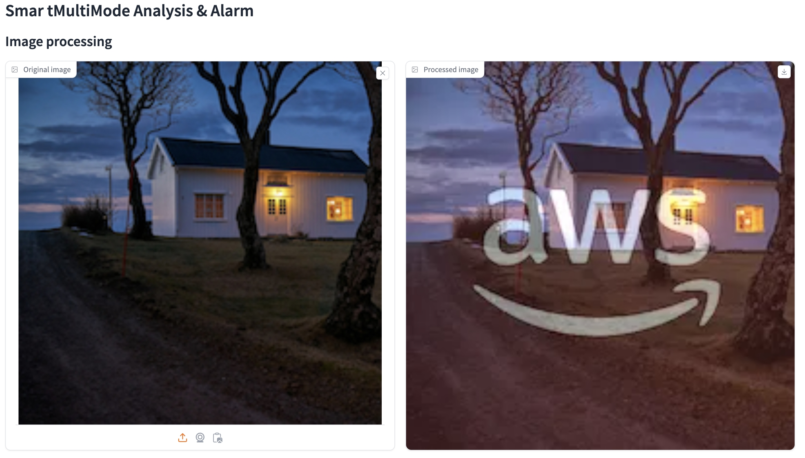
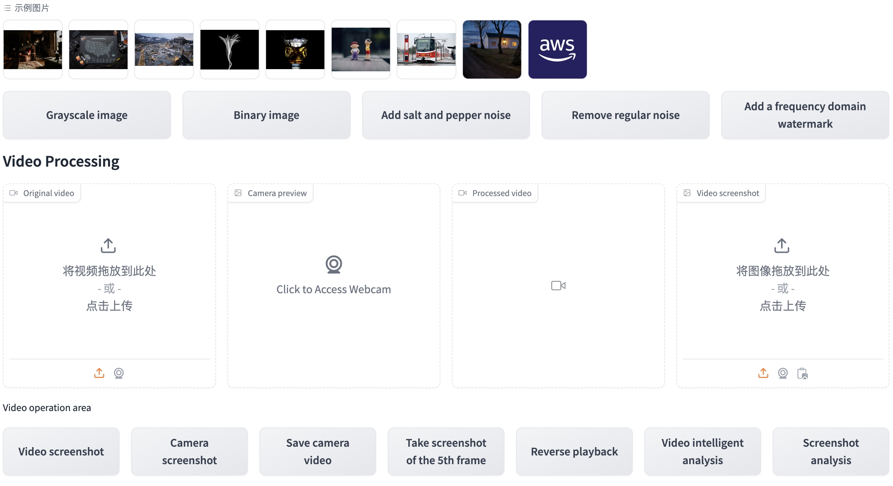
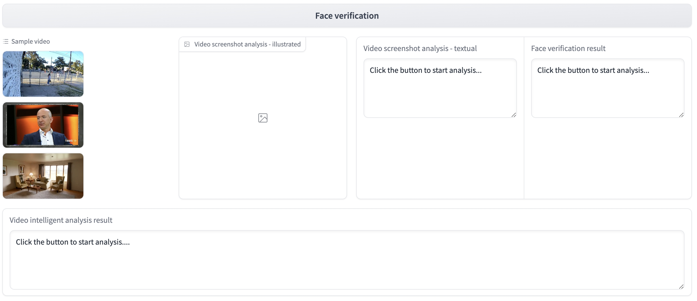
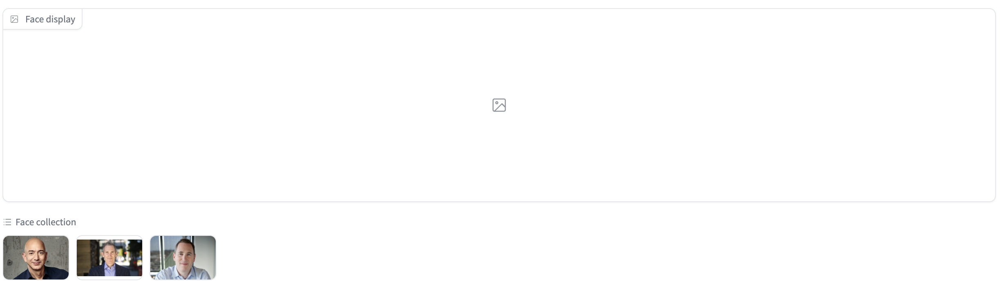

# SmartMultiModeAnalysis
This is a Python project that allows you to:
1. Perform Image/Video processing using Amazon EC2
2. Intelligent Processing/Analysis Video using Amazon Bedrock
3. Face Security Verification using Amazon Rekognition
4. Raise an Alarm accroding to the bedrock analysis results by Amazon Bedrock Agent and SES
the user-friendly interface built with Gradio.

# WebUI of SmartMultiModeAnalysis





# Quick Start
Deploying this solution on Amazon Web Service.

If you have AWS Account, you can:

 Click here to [Start Quickly]( AWS Cloudforamtion Quicklink)

Or you can:
1. Navigate to AWS CloudFormation
2. Specify this [template](template/smartAnalysisAlarm.yaml)
3. Quickly pull up all the resources needed for the solution.
4. Then Go into “Installation” Step.

# Installation

Clone the repository:

```
git clone https://github.com/jiaMery/SmartMultiModeAnalysis.git
```

Navigate to the project directory:

```
cd SmartMultiModeAnalysis
```


Create a virtual environment (optional but recommended), I tested my script on
Python 3.12:

```
python3 -m venv env
source env/bin/activate
```

or with conda:

```
conda create -n smartAnalysisAlarm

conda activate smartAnalysisAlarm
```

Install the required packages:

```
pip install -r requirements.txt
```

Start the application:

```
python webui2.py
```

Upload an audio file (in .mp4, .mov format).
