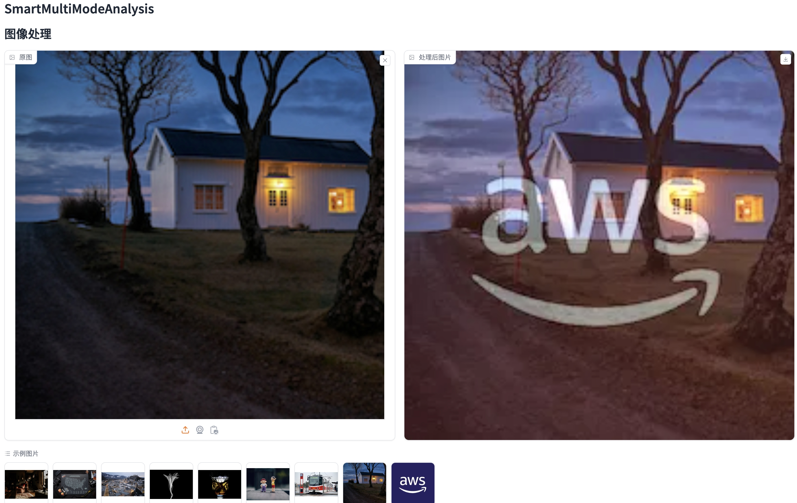
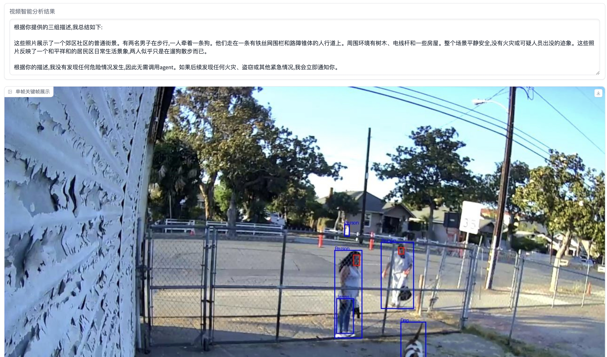
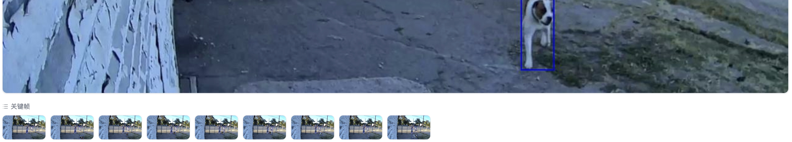

# SmartMultiModeAnalysis

# WebUI of SmartMultiModeAnalysis





# Installation

Clone the repository:

```
git clone https://github.com/jiaMery/SmartMultiModeAnalysis.git
```

Navigate to the project directory:

```
cd SmartMultiModeAnalysis
```


Create a virtual environment (optional but recommended), I tested my script on
Python 3.12:

```
python3 -m venv env
source env/bin/activate
```

or with conda:

```
conda create -n smartChatbot

conda activate smartChatbot
```

Install the required packages:

```
pip install -r requirements.txt
```

Start the application:

```
python webui2.py
```

Upload an audio file (in .mp4, .mov format).
